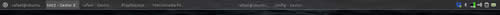
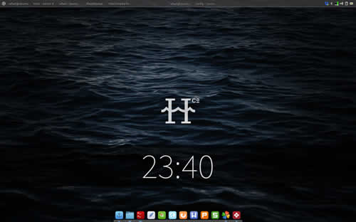

# Tint2-taskbar

Hiya!

This is my tint2 config to obtain this panel:

The Ubuntu icon at the top left corner is a Whisker Menu placed over the tint2 panel.

In a full screenshot it would look some like this:

## Installation
1. Download zip (or clone this repo).
2. Extract files.
3. Pick tint2rc-taskbar and put it into tint2 config folder (usually: ~/.config/tint2/ ).
4. Rename tint2rc-taskbar to tint2rc or run it with `tint2 -c ~/.config/tint2/tint2rc-taskbar`.